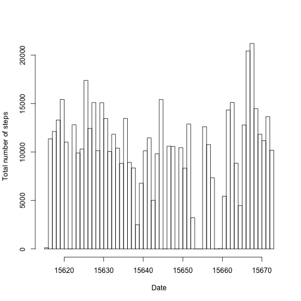
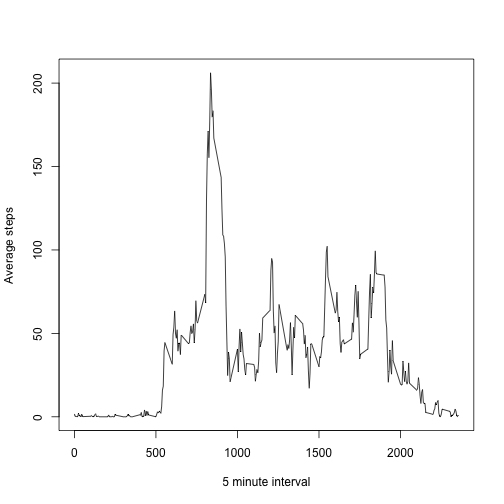
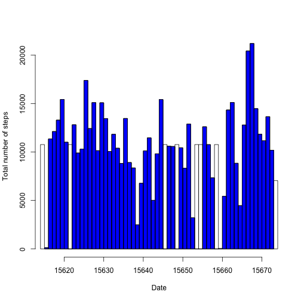
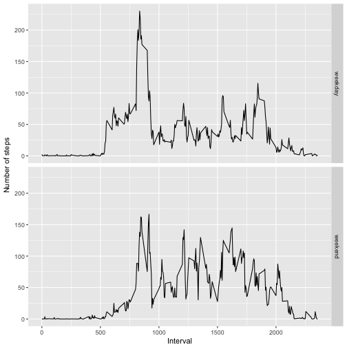

## Loading and preprocessing the data


```r
Sys.setenv(TZ="Europe/Moscow")
raw.data <- read.csv(unzip("activity.zip"))
raw.data$date <- as.Date(raw.data$date, format = "%Y-%m-%d", tz = getOption("tz"))
```

## What is mean total number of steps taken per day?


```r
data.rm.na <- raw.data[!is.na(raw.data$steps),]
h1 <- hist(data.rm.na$date, breaks = "day", plot = FALSE)
breaks <- data.frame("beg" = h1$breaks[-length(h1$breaks)], "end" = h1$breaks[-1])
sums <- apply(breaks, MARGIN=1, FUN=function(x) { sum(data.rm.na$steps[ data.rm.na$date >= x[1] & data.rm.na$date < x[2] ]) })
h1$counts <- sums
plot(h1, ylab = "Total number of steps", xlab = "Date", main = " ")
```



```r
invisible(dev.copy(png, "./figure/NumberOfStepsPerDay.png", width=480, height=480))
invisible(dev.off())
aggr.data <- aggregate(raw.data$steps ~ raw.data$date, data = raw.data, sum, na.rm = TRUE)
step.median <- median(aggr.data$`raw.data$steps`, na.rm = TRUE)
step.mean <- mean(aggr.data$`raw.data$steps`, na.rm = TRUE)
names(aggr.data) <- c("Date", "Total Steps")
```

The mean and median of the total number of steps taken per day are **10766** and **10765** respectively.


## What is the average daily activity pattern?

```r
daily.pattern.data <- aggregate(raw.data$steps ~ raw.data$interval, data = raw.data, mean, na.rm = TRUE )
max.interval <- daily.pattern.data$`raw.data$interval`[daily.pattern.data$`raw.data$steps` == max(daily.pattern.data$`raw.data$steps`)]
plot(daily.pattern.data$`raw.data$interval`, daily.pattern.data$`raw.data$steps`, type = "l", xlab = "5 minute interval", ylab = "Average steps")
```



```r
invisible(dev.copy(png, "./figure/AverageActivityPattern.png", width=480, height=480))
invisible(dev.off())
```

The 5-minute interval which, on average across all the days in the dataset, contains the maximum number of steps is **835**.


##Imputing missing values

Missing values is to be repleced by average activity pattern values.

```r
new.data <- raw.data
miss.steps <- new.data$steps[is.na(new.data$steps)]
new.data$steps[is.na(new.data$steps)] <- daily.pattern.data$`raw.data$steps`[match(new.data$interval, daily.pattern.data$`raw.data$interval`)]

h2 <- hist(new.data$date, breaks = "day", plot = FALSE)
breaks <- data.frame("beg" = h2$breaks[-length(h2$breaks)], "end" = h2$breaks[-1])
sums <- apply(breaks, MARGIN=1, FUN=function(x) { sum(new.data$steps[ new.data$date >= x[1] & new.data$date < x[2] ]) })
h2$counts <- sums
plot(h1, ylab = "Total number of steps", xlab = "Date", main = " ", col = rgb(0,0,1,1))
plot(h2, ylab = "Total number of steps", xlab = "Date", main = " " , add = T)
```



```r
invisible(dev.copy(png, "./figure/MissingValuesSubs.png", width=480, height=480))
invisible(dev.off())
aggr.data <- aggregate(new.data$steps ~ new.data$date, data = new.data, sum, na.rm = TRUE)
step.median <- median(aggr.data$`new.data$steps`, na.rm = TRUE)
step.mean <- mean(aggr.data$`new.data$steps`, na.rm = TRUE)
names(aggr.data) <- c("Date", "Total Steps")
```
The mean and median total number of steps taken per day has been changed to **10766** and **10766** respectively. As we see median is increased. 
Total number of missing values in the dataset is **2304**


##Are there differences in activity patterns between weekdays and weekends?


```r
library("chron", lib.loc="~/Library/R/3.4/library")
library("dplyr", lib.loc="~/Library/R/3.4/library")
library("ggplot2", lib.loc="~/Library/R/3.4/library")
enriched.data <- new.data
enriched.data <- mutate(enriched.data, weekpart = ifelse(is.weekend(date) == TRUE, 1, 0))
enriched.data$weekpart <- factor(enriched.data$weekpart)
levels(enriched.data$weekpart) = c("weekday", "weekend")
aggr.data.w <- aggregate(enriched.data$steps ~ enriched.data$weekpart + enriched.data$interval, data = enriched.data, mean, na.rm = TRUE)
qplot(`enriched.data$interval`,`enriched.data$steps`, data = aggr.data.w, facets = `enriched.data$weekpart` ~. , geom = "line", xlab = "Interval", ylab = "Number of steps")
```



```r
invisible(dev.copy(png, "./figure/WeekPartMatter.png", width=480, height=480))
invisible(dev.off())
```

